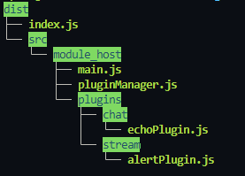

# TypeScript-Workbench

## Work Environment

commit legend is simple:

- "-" means something got removed,

- "=" means work in progress,

- "+" means the specific script's pipeline is connected,

- "*" means it has been stress tested.

In case the work progress upon commit is within an abstract grey zone in between two in this legend, put both.
Explain things in code comments so its displayed in the CLI server-side too.

[how to setup workspace](documentation/environment.md)

## File System

After building with yarn in "dist/"

